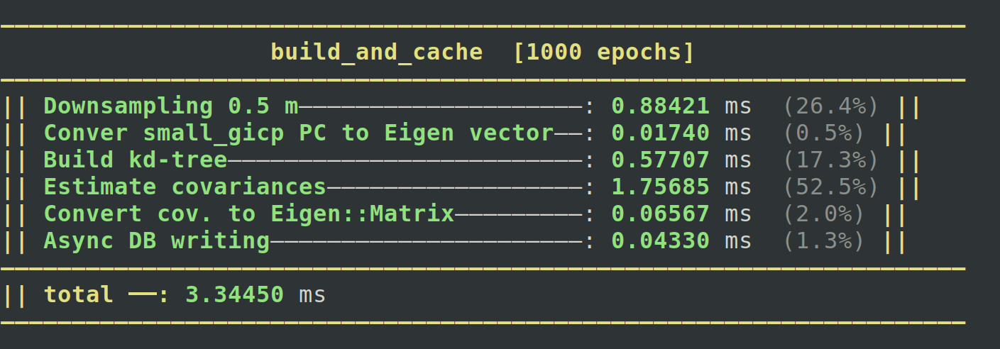

# jamanak



**jamanak** is a tiny C++ timing/benchmark helper that measures durations and prints them in a formated, colorful table.

---

## Features

- Simple start/stop timing API
- Stores multiple measurements ("jams")
- Pretty ANSI-colored output (terminal)
- Easy to embed into other CMake projects

---

## Requirements

- C++17 (or newer)
- CMake ≥ 3.16
- A terminal that supports ANSI escape codes

---

## Installation

### Build & install

```bash
cd ~/third_party
git clone <REPO_URL_HERE>
cd jamanak
mkdir build && cd build

cmake .. -DCMAKE_BUILD_TYPE=Release -DBUILD_EXAMPLES=ON
make -j"$(nproc)"
sudo cmake --install
sudo ldconfig
```

### Run the example

After building with -DBUILD_EXAMPLES=ON:

```bash
./build/jamanak_example
```

Notes
Output uses ANSI colors. If you pipe output to a file, you may want to disable colors.

Durations are currently formatted in milliseconds.

---

## Usage

In the CMakeLists

```cmake

find_package(jamanak REQUIRED)

target_link_libraries(your_executable PRIVATE jamanak::jamanak)
```

In the code 

```c++
#include "jamanak.hpp"
#include <iostream>

int main() {
    jamanak::Jamanak durations("Tasks");

    durations.begin_epoch();

    for (auto epoch=0; epoch < N; epoch++) {

        durations.start("task A");
        // ... do task A ...
        durations.end();

        durations.start("task B");
        // ... do task B ...
        durations.end();

        durations.start("task C");
        // ... do task C ...
        durations.end();

        // std::cout << durations.to_string();
    }
   
    durations.end_epoch();

    std::cout << durations.to_string_epochs();
}
```
